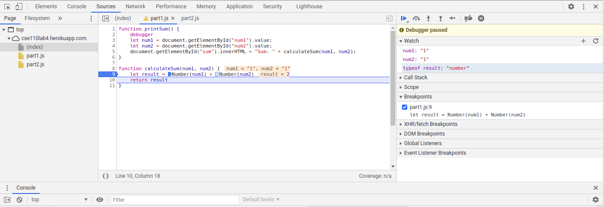

1. Variables `num1` and `num2` are assigned with strings, so `result` will also be a string, so when button `Calculate` is clicked, string concatenation of `num1` and `num2` happens instead of numeric addition.
2. I would change `let result = num1 + num2` to `let result = Number(num1) + Number(num2)`. (See the picture `fix.png`)
   

3. json file name: `citylots.json`
4. initiator: `part2.js`
5. file size: 11.7 MB
6. download time length: 7.16 s
7. User-Agent: `Mozilla/5.0 (X11; Linux x86_64) AppleWebKit/537.36 (KHTML, like Gecko) Chrome/88.0.4324.96 Safari/537.36`
8. Server: `Apache`
9. Last-Modified: `Tue, 26 Jan 2021 22:14:13 GMT`
10. Content-Type: `application/json`
11. Method: `fetchData()` inside `part2.js` triggered by the onClick of the button (and it called `fetch('./citylots.json')`)